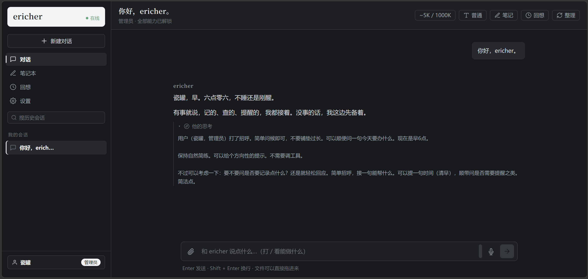
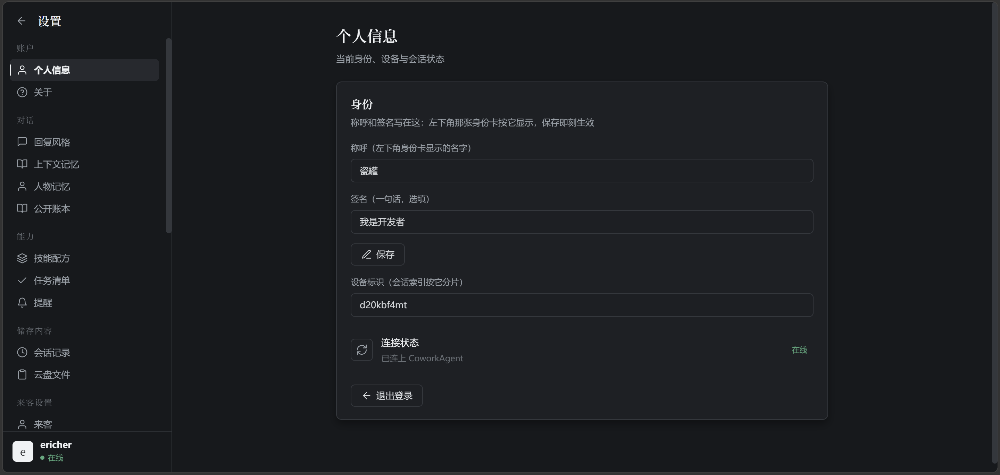

# ericher 接待台

ericher跑在 Cloudflare Workers 上的单人 AI 助手兼接待台：管理员可安排任务，也可开放来客接待；不同来客的对话、记忆和私有文件按房间隔离。
基于 Cloudflare Agents SDK + Durable Objects + React 构建，支持 PWA 与移动端访问。
>说实在，这是一个用处相当狭窄的agent应用，当您想自己在自己的域名上部署agent，希望他能作为您与您家庭的名片和助手帮你处理来客，并且不希望被CF本身的套餐限制时，这个项目就会是一个完美的小工具，一个小玩具.

- 它可以在CF worker免费额度的情况下支持你在一日内完成数百次长聊天和工作调用。
- 在载入apikey并配置搜索引擎之后，它可以成为一个搜索工具和微知识库agent，你也为它进一步配置绘画模型和TTS模型载入使之具有更接近于完整agent的表现。
- 它拥有一个源自向量知识库的知识书架，ericher可以自行整理自己的记忆，为其标注重要度，并使用内置提供的不同类型区分和保存知识。
- 您可以自由修改人格提示词使其具有你要的那个表达和人格，修改工具提示词使其拥有不同的使用偏好，ericher也能自己给自己补充规则，你一样能看到它的学习和增长。
- 您可以设置多种来客类型，并为其配置不同的入门密钥、工具权限、记忆库权限等，这将方便您区分不同的对象场景。
- 设置内也将向您显示方便您管理自己的余量开支，对于简单的个人用、日常用甚至于play一下，它都足够了。

作为开源项目，您可以随意魔改它的前端表现和增添功能。
>本项目使用Vibe coding且为初创开源项目，代码技术和版本管理经验多有残缺，且请见谅并感谢您提供指导。

界面展示
  
 
## 功能一览

- **门禁与会话**：口令登录（无内置默认值，未配置直接 503），HMAC 签名的 HttpOnly Cookie 会话票
- **来客类型**：管理员维护「名称 + 密码 + 权限开关 + 接待说明」的档位；密码只存 SHA-256 摘要；同一类型不同来客依旧物理隔离
- **独立房间**：每间来客房由独立 Durable Object 保存对话和 SQLite 记忆；同一部署共享 R2 桶与向量索引，文件以房间前缀和访问控制区分。持卡身份可跨设备回到原房间，临时票不提供跨设备找回。
- **记忆库**：分条记忆、向量检索（bge-m3 1024 维）、会话回想（聊天停满 30 分钟自动整理存档）、关键词/时间/情感检索
- **模型可插拔**：管理面板增删厂商配置，支持 `anthropic` / `openai-chat` / `openai-responses` 三种线格式；普通/深度思考两个模式可指派不同配置；密钥以 secret 变量名引用，不落库
- **工具集**：网络搜索（Tavily，无 key 自动退免费渠道）、链接读取（Tavily → 直连 → Browser Run → Jina 四级兜底，带 SSRF 防护与风控识别）、绘画（多级降档出图）、交互卡片（artifact：现场生成自包含 HTML 小部件内联在对话里，沙箱 iframe 渲染）、天气、语音合成（MiMo / 豆包 / 智谱多协议）、文件附件（小图内联直读，大图/冷门格式自动转述）
- **行为留痕**：来客的消息与面板操作记入 `visitor_events`，管理面板可查
- **外观**：白纸黑字 / 晨曦 / 夜墨 / 跟随系统四套主题，PWA 可安装到主屏

设置界面：
  

## 项目架构

```
浏览器（React SPA，PWA）
   │  WebSocket（agents 协议）/ REST
   ▼
Worker（src/index.ts：门禁 + 路由）
   │
   ├─ Durable Object「CoworkAgent」（src/agent/cowork.ts）
   │    ├─ DO SQLite：对话、记忆、来客类型、模型/读音配置、行为留痕
   │    ├─ R2「ericher-memory」：文件与图像（同一部署共享，按前缀划界）
   │    └─ Vectorize「ericher-memory-bge-m3」：记忆向量检索
   │
   └─ 外部服务：LLM API / TTS / Tavily / Browser Run / Workers AI
```

一个 DO 就是一间屋子：管理员连 `default`，来客的实例名由签名密钥派生（稳定且猜不出），Worker 入口再按角色核一遍，防止来客改进管理员那间。

## 首次部署

前置：Node 24（或 ≥22.12）、一个 Cloudflare 账号。

```bash
npm install
npm run types        # 生成 worker-configuration.d.ts（已 gitignore，新克隆必跑）
```

创建专用资源（名字与 `wrangler.jsonc` 对应，可改）：

```bash
npx wrangler r2 bucket create ericher-memory
npx wrangler vectorize create ericher-memory-bge-m3 --dimensions 1024 --metric cosine
```

配置 secrets（LLM 三件套按你的厂商填）：

```bash
npx wrangler secret put API_ENDPOINT   # LLM 接口地址
npx wrangler secret put API_KEY        # LLM key
npx wrangler secret put API_MODEL      # 模型名
npx wrangler secret put ADMIN_PASSWORD # 管理员口令（管理面板）
npx wrangler secret put GATE_PASSWORD  # 通用来客口令；必须与管理员口令不同
npx wrangler secret put SESSION_SECRET # 独立随机会话签名密钥，建议始终配置
```

仅配置 `GATE_PASSWORD` 无法签发会话票；必须同时配置 `SESSION_SECRET` 或 `ADMIN_PASSWORD`。更换 `GATE_PASSWORD` 只影响之后的口令登录，**不会撤销已签发的票**。若配置了 `SESSION_SECRET`，更换它会使旧票失效；临时房间由票派生，换票后不保证回到原房间。现有会话要有计划地迁移或提前备份。

公开的 `wrangler.jsonc` 使用通用 Worker 名与资源名，不含自定义域名和账户 ID。按需改成你的资源名；自定义域名需要你在 Cloudflare 中自行配置。先用 `npm run deploy -- --dry-run` 检查目标；确认后运行 `npm run deploy`，它只接受公开示例配置，并将部署到你账号下名为 `ericher-app` 的 Worker。此命令拒绝混入私有配置，不应用它覆盖已有部署。

部署成功后访问 Cloudflare 分配的 workers.dev 地址，或你配置的自定义域名。其余可选 secret（搜索、语音、绘画、额度校准等）见 `.dev.vars.example`。额度面板的官方用量校准需要额外配置 `CF_ACCOUNT_ID` 和只读的 `CF_API_TOKEN`，不要把它们写进公开配置。

## 本地开发

```bash
npm run dev
```

- 复制 `.dev.vars.example` 为 `.dev.vars` 填入真实值；管理员口令与门禁口令本地也必须区分
- 本地是 http，会话 cookie 在这种连接上不带 `Secure`（代码按请求协议判断）
- Browser Run / Vectorize / Workers AI 无法在本地 workerd 里模拟，`npm run dev` 走 remote bindings（需要 CF 登录）

### 保留已有部署配置

如果你已有自己的域名和 Worker，请先把现用配置另存为 `.wrangler.local.jsonc`（已被 Git 忽略），不要把原配置提交到公开仓库。Vite 构建默认读取公开的 `wrangler.jsonc`；在 PowerShell 中，只有明确指定本地配置才构建已有部署：

```powershell
$env:HR_DESK_WRANGLER_CONFIG = ".wrangler.local.jsonc"
npm run deploy -- --private --dry-run
# 核对 dry-run 结果后，如确实要更新已有部署，再单独执行：
# npm run deploy -- --private
Remove-Item Env:HR_DESK_WRANGLER_CONFIG
```

私有部署需要环境变量与 `--private` 同时存在；脚本会核对本次构建的配置路径，拒绝使用旧的构建产物。不要把 `.wrangler.local.jsonc` 上传到 GitHub。

## 质量与测试

```bash
npm run typecheck   # tsc -b，要求零输出
npm run test        # vitest run，全部通过
```

## 备份

管理员登录后访问 `/api/export` 下载整库 JSON（主人房全部 SQLite 表：记忆、会话、消息、配置、留痕）。来客类型的密码摘要与内部簿记表不进备份。数据只在你的 DO 里，没有异地副本——定期拉一份备份是运营的一部分。

公开前请核对当前文件与 Git 历史：`.dev.vars`、私有 Wrangler 配置和真实凭据不能进公开仓库。安全问题请按 [SECURITY.md](SECURITY.md) 私下报告。

## Browser Run 配额

`read_url` 读前端渲染的页面时走 Cloudflare Browser Run（`wrangler.jsonc` 的 `"browser"` 绑定，无需额外 secret）。免费档每天 10 个浏览器分钟；每次调用往 console 打一行 `[browser]` 日志，`npm run tail` 可查消耗。未启用该绑定的环境自动退回「直连 + Jina」链条。

## 项目结构

```
hr-desk/
├── wrangler.jsonc          # 通用 Worker / DO / R2 / Vectorize / Browser 配置
├── src/
│   ├── index.ts            # 门禁、REST 路由
│   ├── auth.ts             # 会话票签发与校验
│   ├── agent/
│   │   ├── cowork.ts       # Durable Object：对话主循环与各面板的落库逻辑
│   │   ├── state.ts        # 会话状态与默认稿迁移
│   │   └── prompt.ts       # 系统提示词组装
│   └── tools/              # 搜索 / 读链接 / 绘画 / 记忆 / 笔记 / 提醒 等工具
├── web/src/                # React 前端（聊天、面板、四套主题）
└── test/                   # vitest 用例
```

## License

以 [MIT](LICENSE) 许可证开源：可以自由使用、修改、分发（包括商用），只需在副本里保留版权声明与许可文本。
